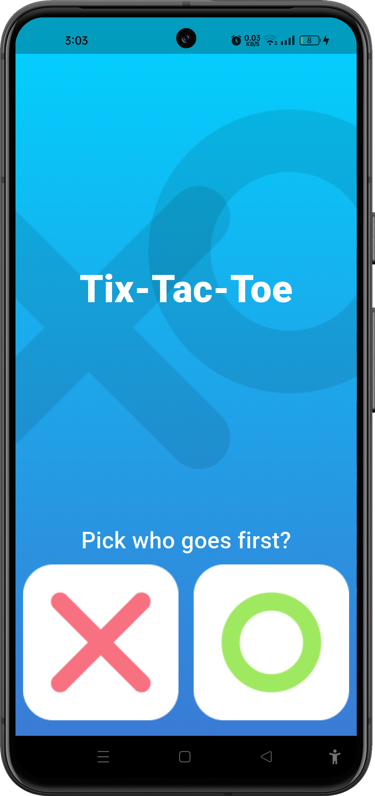
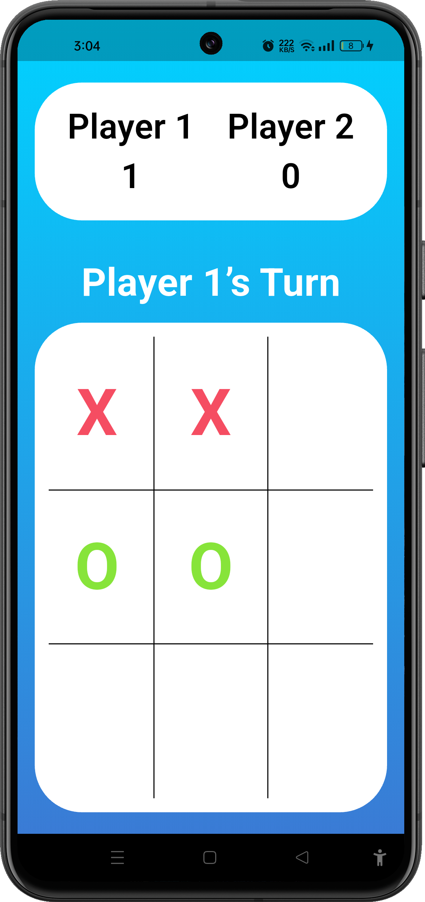

# xo_game_project

A new Flutter project.

## ❌⭕ Tic-Tac-Toe (XO Game)

A simple two-player Tic-Tac-Toe game built with Flutter.

## Description

Play the classic Tic-Tac-Toe game on your device! Two players take turns on the same screen — pick who goes first, then battle it out on a 3×3 board. Scores are tracked across rounds and the board resets automatically after each game.

## Features

- 🎮 Two-player local multiplayer
- 🔢 Live score tracking for both players
- 🏆 Automatic win and draw detection
- 🔄 Auto board reset after each round
- 🎨 Clean gradient UI (cyan → blue)

## Tech Stack

- **Flutter** – UI framework
- **Dart** – Programming language

## Screenshots

| Home Screen | Game Board |
|---|---|
|  |  |

## How to Run

```bash
# 1. Clone the repository
git clone https://github.com/fatmanagaa/xo_game_project.git
cd xo_game_project

# 2. Install dependencies
flutter pub get

# 3. Run the app
flutter run
```
